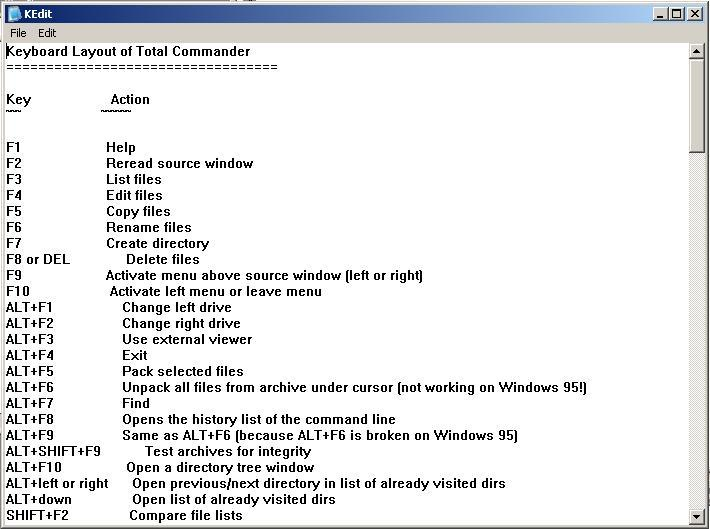



## KEdit example of C/C\+\+ style of programming with API made form and controls

### Description

KEdit is an example texteditor I made to learn how to make windowsprogram without using any VBforms or controls, all is made with pure API like the style a C or C++ programmer would have done it. With messageloop and wndproc to handle messages.

This application is quite useless but learning how to do it was really fun :-)
 
### More Info
 

             |
---                |---
**Submitted On**   |2004-07-14 00:15:42
**By**             |[Knoton](https://github.com/Planet-Source-Code/PSCIndex/blob/master/ByAuthor/knoton.md)
**Level**          |Intermediate
**User Rating**    |5.0 (15 globes from 3 users)
**Compatibility**  |VB 6\.0
**Category**       |[Windows API Call/ Explanation](https://github.com/Planet-Source-Code/PSCIndex/blob/master/ByCategory/windows-api-call-explanation__1-39.md)
**World**          |[Visual Basic](https://github.com/Planet-Source-Code/PSCIndex/blob/master/ByWorld/visual-basic.md)
**Archive File**   |[KEdit\_exam1769907142004\.zip](https://github.com/Planet-Source-Code/knoton-kedit-example-of-c-c-style-of-programming-with-api-made-form-and-controls__1-54949/archive/master.zip)

